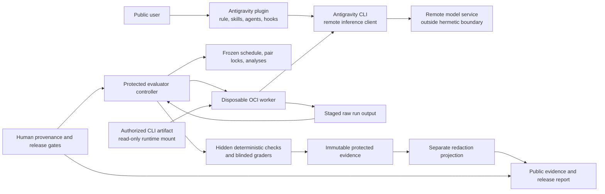

# Architecture and Trust Boundaries

**Status**: Accepted handoff architecture; changes require a spec/plan amendment

The project separates an inspectable, dependency-free runtime plugin from a
protected evaluation controller. The model receives only an agent-visible task
projection. Hidden checks, condition labels, competing runs, randomization,
sealed instances, and release decisions remain outside the worker.

## Responsibility Boundaries

| Boundary | Owns | Must not own |
|---|---|---|
| Runtime plugin | Original instructions, deterministic state mechanics, qualified packaging | Hidden graders, protected evidence, base-model routing, upstream skill copies |
| Antigravity adapter | Exact argument vector, stream preservation, model/effort request, preflights | Silent fallback, task success, fabricated served identity |
| OCI worker | Fresh profile/repository, scoped execution, staged output | CLI/image embedding, hidden labels, competing runs, release decisions |
| Evaluator controller | Scheduling, pair locks, classification, evidence import, grading orchestration | Agent-visible treatment hints, post-result protocol changes |
| Protected evidence store | Immutable attempts, lifecycle, runs, grades, approvals | Public distribution or in-place redaction |
| Public projection | Redacted, digest-linked methods and per-run evidence | Credentials, private paths, hidden checks, sealed inputs, private calibration |
| Human gate | License/provenance judgment, candidate freeze, release/publication authority | Automated or self-issued approval |

## Fixed Architectural Decisions

- Antigravity CLI is the sole v1 release-gating product surface.
- Gemini 3.7 Flash and Gemini 3.1 Pro each run the complete suite independently;
  their results are never pooled for a release decision.
- Runtime JavaScript has no npm dependency and hooks have no network access.
- The evaluator is Python, protected from the worker, and stores append-only,
  content-addressed evidence.
- The CLI binary is absent from source and image layers and is mounted read-only
  at `/opt/antigravity/bin/agy` for an authorized run.
- ScheduledAttempt identity, AttemptLifecycleEvent history, and atomic RunRecord
  finalization are separate responsibilities.
- Public causal evidence uses protocols, variants, analyses, and resource
  envelopes frozen before treatment; post-treatment diagnostics are noncausal.
- The automated Codex CLI reference and private desktop calibration are separate
  lanes. Neither can silently become a public-release prerequisite.

See `docs/decisions/0001-eval-first-split-runtime-controller.md` and
`docs/decisions/0002-public-composition-and-human-gates.md` for rationale.
